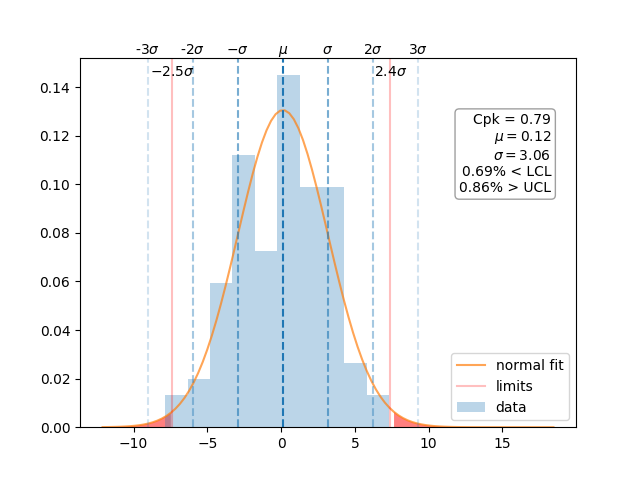
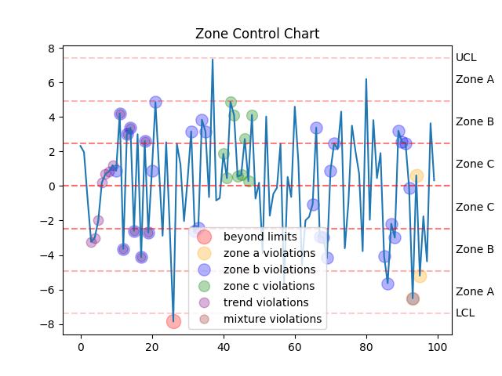

# Purpose

To provide analysis tools and metrics useful in manufacturing environments.

# Project Maturity

Every effort is being made to ensure that the results are accurate, but the user is ultimately
responsible for any resulting analysis.

The API should not be considered stable until v1.0 or greater.  Until then, breaking changes may
be released as different API options are explored.

# Installation

## From `setup.py`

Use this method to get the latest features.  Note that this may result in an installation that
is not stable!

Clone this repository and install into your python environment using `setuptools`.

    $ git clone https://github.com/slightlynybbled/manufacturing
    $ cd manufacturing
    $ python setup.py install
    
## From Wheel File

[Download the wheel file](https://github.com/slightlynybbled/manufacturing/releases) and install from pip:

    ~/downloads $ python -m pip install manufacturing-X.X.X-py3-none-any.whl
    
Of course, the `X.X.X` will be replaced with the version that you are looking at.

# Usage

## Visualizations with Jupyter Notebooks

Visualizations work approximately as expected within a jupyter notebook.

    data = np.random.normal(0, 1, size=30)  # generate some data
    manufacturing.cpk_plot(data, lower_spec_limit=-2, upper_spec_limit=2)
    
There is a sample jupyter notebook in the examples directory.

## Cpk Visualization

The most useful feature of the `manufacturing` package is the visualization of Cpk.
As hinted previously, the `cpk_plot()` function is the primary method for display of
Cpk visual information.  First, get your data into a `list`, `numpy.array`, or 
`pandas.Series`; then supply that data, along with the `lower_spec_limit` and 
`upper_spec_limit` into the `cpk_plot()` function.

    manufacturing.cpk_plot(data, lower_spec_limit=-2, upper_spec_limit=2)
    

In this example, it appears that the manufacturing processes are not up to the task of 
making consistent product within the specified limits.

## Zone Control Visualization

Another useful feature is the zone control visualization.

    manufacturing.control_plot(data, lower_spec_limit=-7.0, upper_spec_limit=7.0)

# Features Map

## Analysis

 * ~~Cpk analysis~~
 * ~~Cpk plots/histograms~~
 * Ppk analysis/plot/histogram
 * In-control/out-of-control analysis (do Ppk and Cpk converge to approximately the same value)
 * Control chart plot (see [Control Chart Rules](https://www.spcforexcel.com/knowledge/control-chart-basics/control-chart-rules-interpretation))
   * ~~Beyond limits violations highlighted~~ (one or more points beyond the control limits)
   * ~~Zone A violations highlighted~~ (2 out of 3 consecutive points in zone A or beyond)
   * ~~Zone B violations highlighted~~ (4 out of 5 consecutive points in zone B or beyond)
   * ~~Zone C violations highlighted~~ (7 or more consecutive points on one side of the average - in zone C or beyond)
   * ~~Trend violations highlighted~~ (7 consecutive points trending up or down)
   * ~~Mixture violations highlighted~~ (8 consecutive points with none in zone C)
   * ~~Stratification violations highlighted~~ (15 consecutive points in zone C)
   * Over-control violations highlighted (14 consecutive points alternating up and down)
 * Gage R&R analysis
 
## Usability

 * ~~Import from CSV~~
 * ~~Import from MS Excel~~
 * Create documentation using [sphinx](http://www.sphinx-doc.org/en/master/)
 * Generate reports

# Gallery

Currently, no distinction is made between Ppk and Cpk, so the entire chart shows the Cpk.

# 

Some of the data for the zone control chard was manipulated in order to display the results.
Note that, if a phenomenon is not present within the data, then it will not be plotted at
all.

# 
