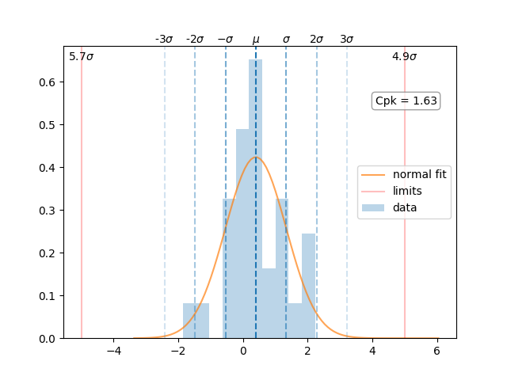
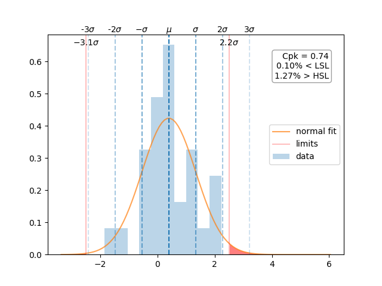

# Purpose

To provide analysis tools and metrics useful in manufacturing environments.

# Project Maturity

Every effort is being made to ensure that the results are accurate, but the user is ultimately
responsible for any resulting analysis.

The API should not be considered stable until v1.0 or greater.  Until then, breaking changes may
be released as different API options are explored.

# Installation

## From `setup.py`

Use this method to get the latest features.  Note that this may result in an installation that
is not stable!

Clone this repository and install into your python environment using `setuptools`.

    $ git clone https://github.com/slightlynybbled/manufacturing
    $ cd manufacturing
    $ python setup.py install
    
## From Wheel File

[Download the wheel file](https://github.com/slightlynybbled/manufacturing/releases) and install from pip:

    ~/downloads $ python -m pip install manufacturing-X.X.X-py3-none-any.whl
    
Of course, the `X.X.X` will be replaced with the version that you are looking at.

# Usage

## Visualizations with Jupyter Notebooks

Visualizations will return a `matplotlib.Figure`; therefore, if you want to embed 
an image into a jupyter notebook, you will need to use a semicolon at the end of
the function call in order to not have a double-image.

    data = np.random.normal(0, 1, size=30)  # generate some data
    manufacturing.show_cpk(data, lower_spec_limit=-2, upper_spec_limit=2);  # show the plot
    
Note the trailing semicolon on the second statement!

## Cpk Visualization

The most useful feature of the `manufacturing` package is the visualization of Cpk.
As hinted previously, the `show_cpk()` function is the primary method for display of
Cpk visual information.  First, get your data into a `list`, `numpy.array`, or 
`pandas.Series`; then supply that data, along with the `lower_spec_limit` and 
`upper_spec_limit` into the `show_cpk()` function.

    manufacturing.show_cpk(data, lower_spec_limit=-2, upper_spec_limit=2)
    

In this example, it appears that the manufacturing processes are not up to the task of 
making consistent product within the specified limits.

# Features

## Analysis

 * ~~Cpk analysis~~
 * ~~Cpk plots/histograms~~
 * In-control/out-of-control analysis
 * Gage R&R analysis
 
## Usability

 * ~~Import from CSV~~
 * ~~Import from MS Excel~~
 * Create documentation using [sphinx](http://www.sphinx-doc.org/en/master/)
 * Generate reports

# Gallery

# 

# 
